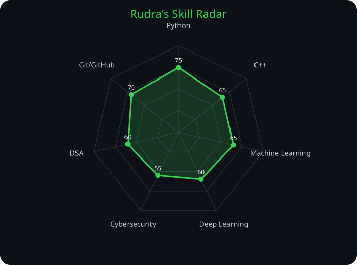

# Hi, I'm Rudra Soni 👋

---

## `~/` whoami

I'm **Rudra Soni**, a Computer Science student focused on building practical projects and improving my skills through consistent coding.

- 🚀 Currently building: **75 Days of Code Challenge**
- 🧠 Learning: **Machine Learning, Deep Learning, Cybersecurity & DSA**
- 🛠️ Turning concepts into working projects
- ⚡ Goal: **Build. Learn. Repeat.**

## 🧰 Toolbox

## 📊 Skill Radar

## 📈 GitHub Activity

## 🐍 Contribution Snake

## ⭐ Featured Projects

### 🔥 75 Days of Code
My ongoing coding challenge covering programming, ML/DL, cybersecurity and computer science concepts.

### 🤖 Machine Learning & Deep Learning
Practical experiments and implementations while learning ML and neural networks.

### 🔐 Cybersecurity
Hands-on learning around networking, security concepts and cybersecurity labs.

### 🧠 DSA
Algorithms, data structures and problem-solving practice.

---

### 💻 Build. Learn. Repeat.

